# Практична робота №1

## Створення та розгортання SAP Fiori застосунків у SAP Business Technology Platform

## Мета роботи

Ознайомитися з основними етапами розробки та розгортання хмарних застосунків у **SAP Business Technology Platform (SAP BTP)**, отримати практичні навички роботи з **SAP Business Application Studio**, **SAP Fiori tools**, **Git/GitHub**, **CI/CD**, **SAP Build Work Zone**, а також створити SAP Fiori Elements застосунок на основі зовнішнього OData-сервісу.

У межах практичної роботи необхідно:

1. частково виконати SAP Mission зі створення SAP Fiori застосунку;
2. створити та запустити тестовий застосунок **Hello World**;
3. налаштувати роботу з Git та GitHub;
4. ознайомитися з процесом CI/CD та розгортання застосунку в SAP BTP;
5. опублікувати застосунок у **SAP Build Work Zone**;
6. створити власний SAP Fiori Elements застосунок **Suppliers**;
7. підключити застосунок до публічного OData-сервісу **Northwind**;
8. налаштувати представлення даних за допомогою OData-анотацій;
9. виконати build та deploy застосунку Suppliers;
10. додати Suppliers до SAP Build Work Zone.

---

## Загальна схема виконання практичної роботи

Практична робота складається з двох основних частин.

### Частина 1. SAP Mission та Hello World

У першій частині використовується SAP Mission, за допомогою якої необхідно ознайомитися з типовим життєвим циклом SAP BTP застосунку:

**SAP BTP Trial → SAP Business Application Studio → Hello World → Git/GitHub → CI/CD → Deploy → SAP Build Work Zone**

У результаті в SAP Build Work Zone повинен бути доступний застосунок **Hello World**.

### Частина 2. Створення застосунку Suppliers

У другій частині необхідно самостійно створити SAP Fiori Elements застосунок, який використовує публічний OData-сервіс Northwind.

Застосунок повинен забезпечувати:

- перегляд списку постачальників;
- фільтрацію постачальників;
- перехід до сторінки окремого постачальника;
- перегляд контактної інформації та адреси постачальника;
- перегляд товарів постачальника;
- перехід до сторінки окремого товару.

---

# 1. Частина 1. SAP Mission та Hello World

## 1.1. Виконання SAP Mission

Для виконання першої частини практичної роботи використовується SAP Mission:

**Set Up SAP BTP for Fiori/SAPUI5 and create a Hello World app**

[SAP Mission — перейти до виконання](https://discovery-center.cloud.sap/protected/index.html#/mymissiondetail/125910/?tab=overview)

> **Важливо:** проходити всю SAP Mission не потрібно. У межах практичної роботи необхідно виконати лише зазначені нижче етапи.

Необхідно опрацювати такі частини Mission:

1. **Discover**
2. **Setup Trial Account for HTML5 Development**
3. **Create an App in Business Application**
4. **Set Up Additional Features**

<p align="center">
    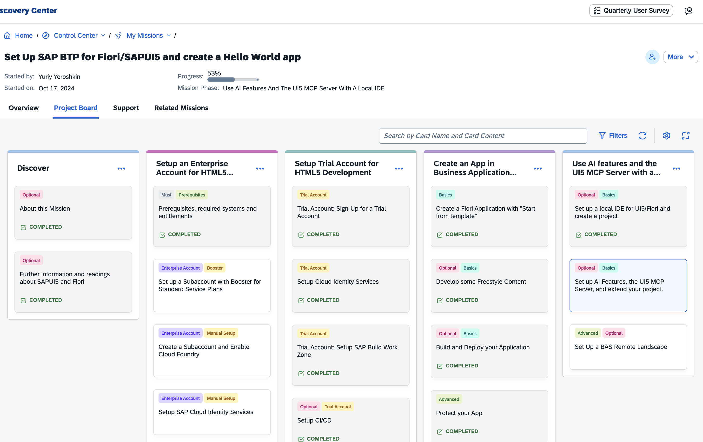
</p>

Під час виконання Mission звертайте увагу не лише на послідовність дій, а й на призначення сервісів SAP BTP, які використовуються для створення, розгортання та публікації застосунку.

---

## 1.2. Підготовка SAP BTP Trial

Виконайте етап:

**Setup Trial Account for HTML5 Development**

Переконайтеся, що SAP BTP Trial Account підготовлений для HTML5-розробки та доступні необхідні сервіси.

Для подальшої роботи необхідно мати доступ до:

- Cloud Identity Services;
- Continuous Integration & Delivery;
- SAP Business Application Studio;
- Cloud Foundry environment;
- SAP Build Work Zone, standard edition.

<p align="center">
    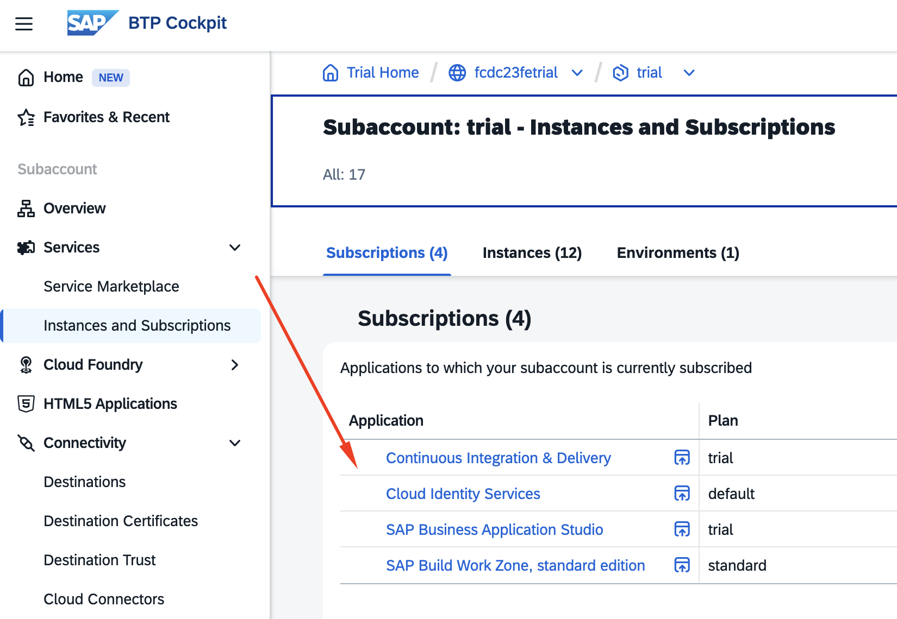
</p>
---

## 1.3. Створення Hello World

Перейдіть до етапу Mission:

**Create an App in Business Application Studio**

Відкрийте **SAP Business Application Studio** та виконайте кроки Mission зі створення тестового застосунку.

> Результатом цього етапу повинен бути працездатний застосунок **Hello World**, запущений із SAP Business Application Studio та з SAP Build Work Zone.

<p align="center">
    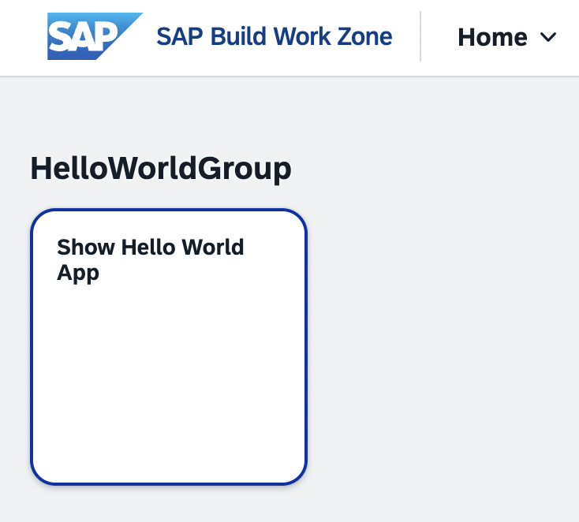
</p>

---

## 1.4. Налаштування Git/GitHub та CI/CD

Перейдіть до етапу Mission:

**Set Up Additional Features**

Виконайте два кроки:

1. **Enable Git and Add a Remote Repository** — налаштуйте Git для проєкту та підключіть віддалений репозиторій GitHub.
2. **Setup Continuous Integration and Delivery Service CI/CD** — налаштуйте CI/CD для автоматичного збирання та розгортання застосунку.

> **Примітка:** у SAP Mission ці кроки позначені як *Optional*, однак у межах практичної роботи їх виконання є обов'язковим.

<p align="center">
    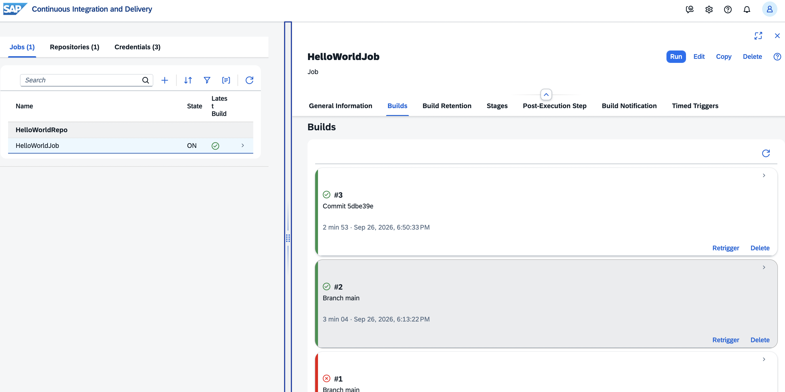
</p>

---

# 2. Частина 2. Створення застосунку Suppliers

## 2.1. Створення Destination у SAP BTP

Для доступу до зовнішнього OData-сервісу необхідно створити Destination у SAP BTP.

У SAP BTP Cockpit відкрийте:

**Connectivity → Destinations**

та створіть новий Destination з такими параметрами:

| Параметр | Значення |
|---|---|
| Name | `Northwind` |
| Type | `HTTP` |
| Description | `Northwind` |
| URL | `https://services.odata.org/` |
| Proxy Type | `Internet` |
| Authentication | `NoAuthentication` |

Додайте такі **Additional Properties**:

| Property | Value |
|---|---|
| `HTML5.DynamicDestination` | `True` |
| `HTML5.Timeout` | `60000` |
| `WebIDEUsage` | `odata_gen` |
| `WebIDEEnabled` | `true` |
| `MobileEnabled` | `True` |
| `usage` | `Backend` |

> **Важливо:** у полі `URL` необхідно вказати лише базову адресу `https://services.odata.org/`. Шлях до конкретного OData-сервісу буде задано пізніше в SAP Fiori generator.

Збережіть Destination.

<p align="center">
    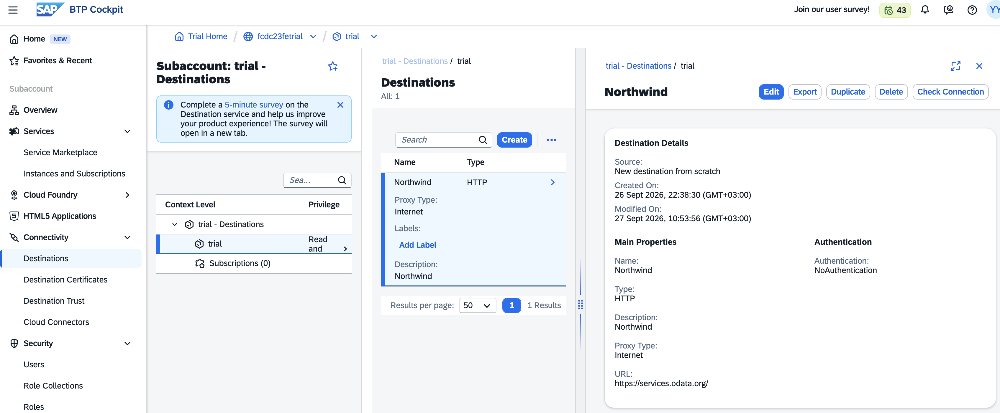
</p>

Після збереження можна скористатися кнопкою **Check Connection** для перевірки доступності сервісу.

---

## 2.2. Створення SAP Fiori Elements застосунку

Відкрийте **SAP Business Application Studio** та запустіть створення нового проєкту:

**File → New Project from Template**

<p align="center">
    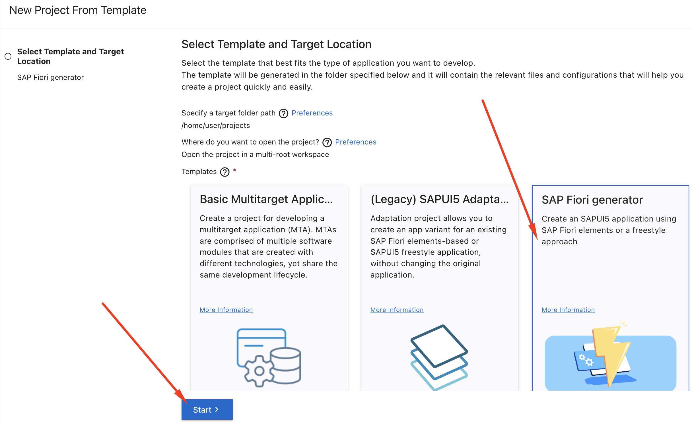
</p>

Оберіть:

**SAP Fiori generator**

і перейдіть до наступного кроку.

Як шаблон застосунку виберіть:

**List Report Page**

<p align="center">
    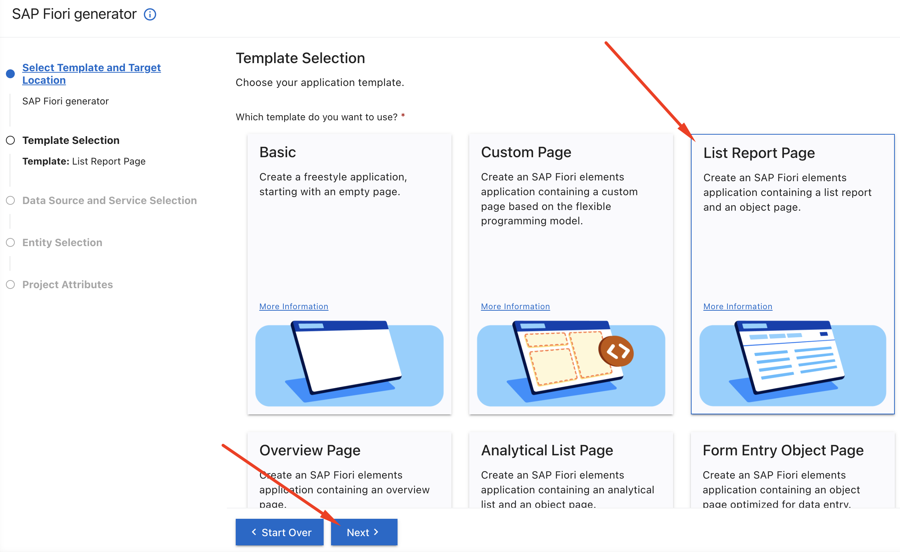
</p>

---

## 2.3. Підключення OData-сервісу

На кроці **Data Source and Service Selection** встановіть:

**Data Source:**

```text
Connect to a System
```

**System:**

```text
Northwind
```

У полі **Service Path** введіть:

```text
V3/Northwind/Northwind.svc/
```

Після завантаження метаданих виберіть сервіс:

```text
https://services.odata.org/V3/Northwind/Northwind.svc/
```
<p align="center">
    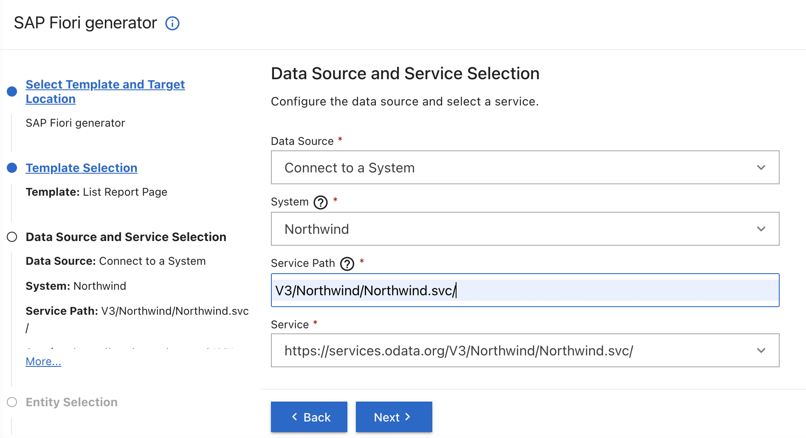
</p>

> **Важливо:** у цій практичній роботі використовується саме **Northwind OData V3**:

>

> ```text
> V3/Northwind/Northwind.svc/
> ```

>

> Не використовуйте `V4/Northwind/Northwind.svc/`.

Натисніть **Next**.

---

## 2.4. Вибір сутностей

На кроці **Entity Selection** встановіть:

| Параметр | Значення |
|---|---|
| Main Entity | `Suppliers` |
| Navigation Entity | `Products` |
| Table Type | `Responsive` |

<p align="center">
    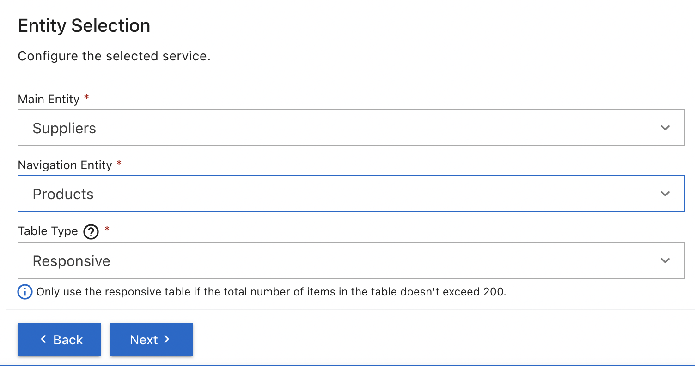
</p>

Таким чином, основною сутністю застосунку будуть постачальники (`Suppliers`), а з Object Page постачальника можна буде перейти до пов'язаних з ним товарів (`Products`).

Натисніть **Next**.

---

## 2.5. Налаштування проєкту

На кроці **Project Attributes** задайте:

| Параметр | Значення |
|---|---|
| Module Name | `suppliers` |
| Application Title | `Suppliers App` |
| Application Namespace | залишити порожнім |
| Description | `An SAP Fiori application.` |
| Project Folder Path | `/home/user/projects` |
| Enable TypeScript | `No` |
| Add Deployment Configuration | `Yes` |
| Add SAP Fiori Launchpad Configuration | `Yes` |
| Use Virtual Endpoints for Local Preview | `No` |
| Configure Advanced Options | `No` |

Для **Minimum SAPUI5 Version** залиште версію, запропоновану генератором.

<p align="center">
    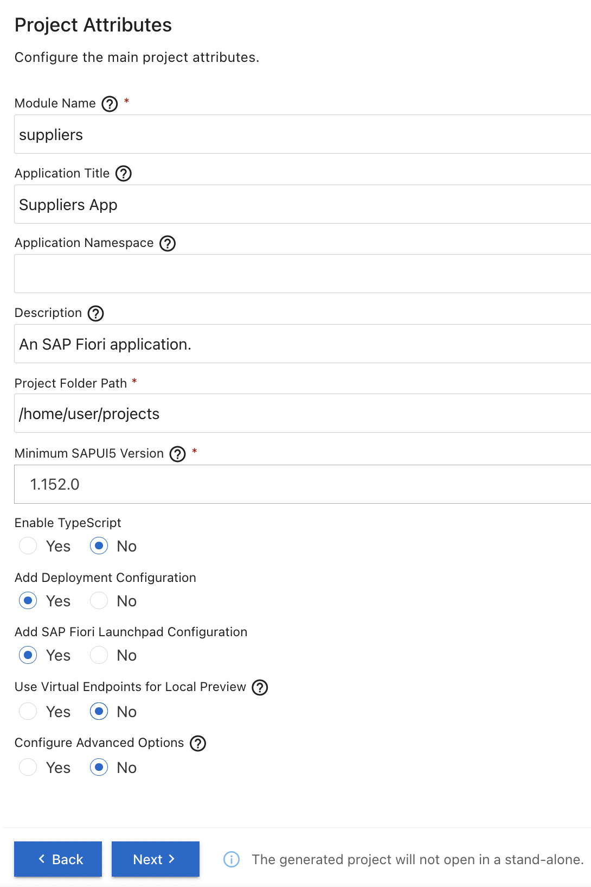
</p>

Натисніть **Next**.

---

## 2.6. Deployment Configuration

На кроці **Deployment Configuration** налаштуйте розгортання застосунку в SAP BTP Cloud Foundry.

Оберіть параметри відповідно до вашого SAP BTP Trial account та Cloud Foundry space.

<p align="center">
    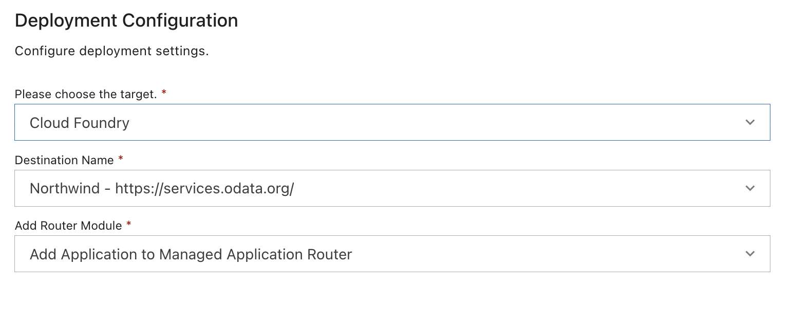
</p>

Після заповнення параметрів натисніть **Next**.

---

## 2.7. SAP Fiori Launchpad Configuration

На кроці **SAP Fiori Launchpad Configuration** задайте:

| Параметр | Значення |
|---|---|
| Semantic Object | `suppliersapp` |
| Action | `display` |
| Title | `Suppliers` |
| Subtitle | `KPI` |

<p align="center">
    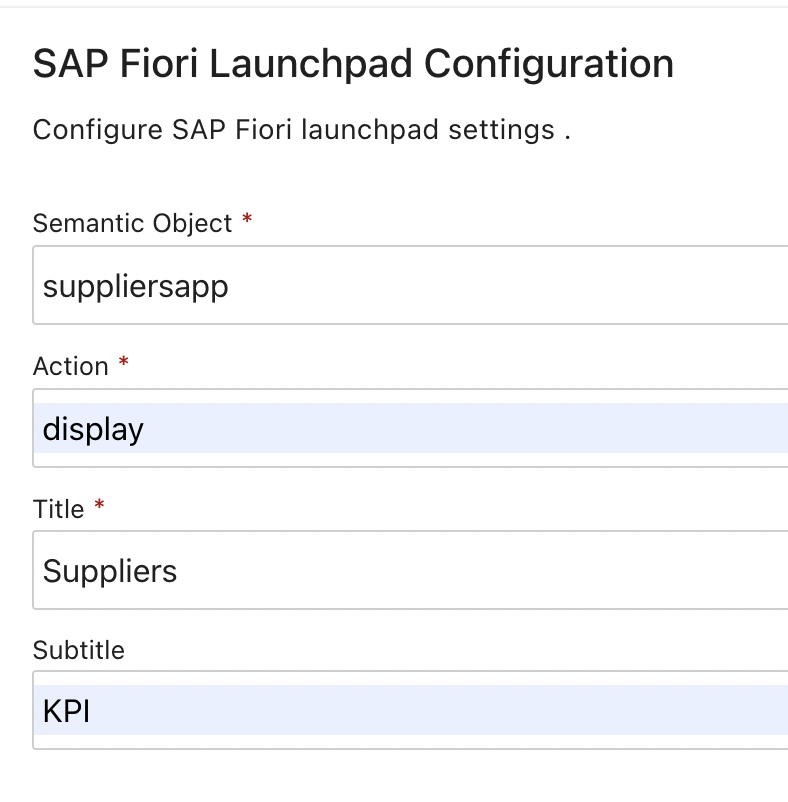
</p>

Натисніть **Finish**.

SAP Business Application Studio згенерує проєкт застосунку.

---

# 2.8. Перший запуск застосунку

Після завершення генерації виконайте Preview застосунку.

Запустіть застосунок у режимі **Preview** та відкрийте List Report.

На цьому етапі застосунок уже підключений до Northwind OData Service і отримує дані, однак інтерфейс ще не налаштований належним чином.

Зокрема:

- таблиця не містить потрібних колонок;

- дані постачальників не представлені у зручному вигляді;

- Object Page не має необхідної структури;

- перехід до детальної інформації та пов'язаних даних ще необхідно налаштувати.

<p align="center">
    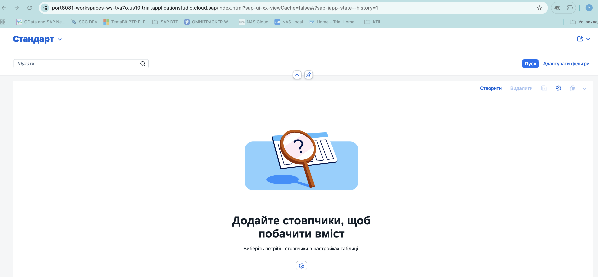
</p>

Причина полягає в тому, що SAP Fiori Elements формує інтерфейс переважно на основі **OData-анотацій**. Тому наступним кроком буде налаштування локального файлу `annotation.xml`.

---

# 2.9. Налаштування List Report

Знайдіть у створеному проєкті файл:

```text
webapp/annotations/annotation.xml
```

> Назва або точне розташування файла може дещо відрізнятися залежно від версії SAP Fiori tools. Використовуйте файл локальних анотацій, створений генератором для OData-сервісу Northwind.

## 2.9.1. Поля Filter Bar

У файлі `annotation.xml` знайдіть елемент:

```xml
<Schema xmlns="http://docs.oasis-open.org/odata/ns/edm" Namespace="local">
</Schema>
```

Всередині елемента <Schema> створіть секцію анотацій для сутності Supplier:

```xml
<Annotations Target="NorthwindModel.Supplier">
</Annotations>
```

Після цього всередині створеної секції додайте анотацію UI.SelectionFields:

```xml
<Annotation Term="UI.SelectionFields">
    <Collection>
        <PropertyPath>CompanyName</PropertyPath>
        <PropertyPath>ContactName</PropertyPath>
        <PropertyPath>Country</PropertyPath>
        <PropertyPath>City</PropertyPath>
    </Collection>
</Annotation>
```

Ця анотація визначає поля, які можуть використовуватися для фільтрації списку постачальників.

---

## 2.9.2. Колонки List Report

Далі необхідно визначити колонки, які відображатимуться в таблиці постачальників на сторінці **List Report**.

У файлі `annotation.xml` знайдіть створену на попередньому кроці секцію:

```xml
<Annotations Target="NorthwindModel.Supplier">
```
Всередині цієї секції, після анотації UI.SelectionFields, додайте анотацію UI.LineItem:

```xml
<Annotation Term="UI.LineItem">
    <Collection>
        <Record Type="UI.DataField">
            <PropertyValue Property="Value" Path="SupplierID" />
            <PropertyValue Property="Label" String="Supplier ID" />
        </Record>
        <Record Type="UI.DataField">
            <PropertyValue Property="Value" Path="CompanyName" />
            <PropertyValue Property="Label" String="Company Name" />
        </Record>
        <Record Type="UI.DataField">
            <PropertyValue Property="Value" Path="ContactName" />
            <PropertyValue Property="Label" String="Contact Name" />
        </Record>
        <Record Type="UI.DataField">
            <PropertyValue Property="Value" Path="ContactTitle" />
            <PropertyValue Property="Label" String="Contact Title" />
        </Record>
        <Record Type="UI.DataField">
            <PropertyValue Property="Value" Path="Country" />
            <PropertyValue Property="Label" String="Country" />
        </Record>
        <Record Type="UI.DataField">
            <PropertyValue Property="Value" Path="City" />
            <PropertyValue Property="Label" String="City" />
        </Record>
        <Record Type="UI.DataField">
            <PropertyValue Property="Value" Path="Phone" />
            <PropertyValue Property="Label" String="Phone" />
        </Record>
    </Collection>
</Annotation>
```

`UI.LineItem` визначає колонки, які SAP Fiori Elements автоматично відображає в таблиці List Report.

Збережіть файл та оновіть Preview.

Після внесення змін у таблиці повинні з'явитися дані постачальників.

<p align="center">
    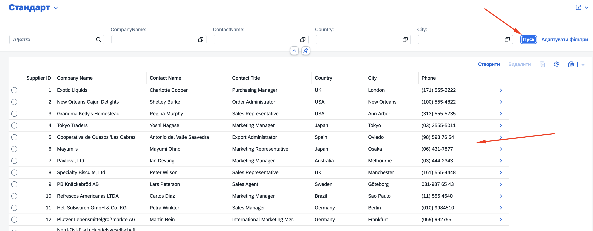
</p>

---

# 2.10. Налаштування Object Page постачальника

Наступним кроком налаштуємо сторінку окремого постачальника.

### 2.10.1. Заголовок Object Page

Далі необхідно налаштувати заголовок сторінки окремого постачальника.

У файлі `annotation.xml` знайдіть створену раніше секцію:

```xml
<Annotations Target="NorthwindModel.Supplier">
```

Всередині цієї секції, **після анотації `UI.LineItem`**, додайте анотацію `UI.HeaderInfo`:

```xml
<Annotation Term="UI.HeaderInfo">
    <Record Type="UI.HeaderInfoType">
        <PropertyValue Property="TypeName" String="Supplier" />
        <PropertyValue Property="TypeNamePlural" String="Suppliers" />
        <PropertyValue Property="Title">
            <Record Type="UI.DataField">
                <PropertyValue Property="Value" Path="CompanyName" />
            </Record>
        </PropertyValue>
        <PropertyValue Property="Description">
            <Record Type="UI.DataField">
                <PropertyValue Property="Value" Path="ContactName" />
            </Record>
        </PropertyValue>
    </Record>
</Annotation>
```

Таким чином, анотація `UI.HeaderInfo` повинна знаходитися **в тій самій секції `NorthwindModel.Supplier`**, що й створені раніше `UI.SelectionFields` та `UI.LineItem`:

```xml
<Annotations Target="NorthwindModel.Supplier">

    <Annotation Term="UI.SelectionFields">
        ...
    </Annotation>

    <Annotation Term="UI.LineItem">
        ...
    </Annotation>

    <Annotation Term="UI.HeaderInfo">
        ...
    </Annotation>

</Annotations>
```

Анотація `UI.HeaderInfo` визначає інформацію, яка відображається в заголовку **Object Page**.

Після додавання анотації в заголовку сторінки постачальника відображатимуться:

- назва компанії (`CompanyName`);
- ім'я контактної особи (`ContactName`).

Збережіть файл та оновіть **Preview**.

---

### 2.10.2. Основна інформація

Далі необхідно створити групу полів з основною інформацією про постачальника, яка відображатиметься на **Object Page**.

У файлі `annotation.xml` знайдіть секцію анотацій для сутності `Supplier`:

```xml
<Annotations Target="NorthwindModel.Supplier">
```

На цьому етапі всередині неї вже повинні знаходитися створені раніше анотації:

```xml
<Annotations Target="NorthwindModel.Supplier">

    <Annotation Term="UI.SelectionFields">
        ...
    </Annotation>

    <Annotation Term="UI.LineItem">
        ...
    </Annotation>

    <Annotation Term="UI.HeaderInfo">
        ...
    </Annotation>

</Annotations>
```

Всередині цієї ж секції, **після `UI.HeaderInfo` і перед закриваючим тегом `</Annotations>`**, додайте нову анотацію `UI.FieldGroup` з кваліфікатором `GeneralInformation`:

```xml
<Annotation Term="UI.FieldGroup" Qualifier="GeneralInformation">
    <Record Type="UI.FieldGroupType">
        <PropertyValue Property="Label" String="General Information" />
        <PropertyValue Property="Data">
            <Collection>
                <Record Type="UI.DataField">
                    <PropertyValue Property="Label" String="Supplier ID" />
                    <PropertyValue Property="Value" Path="SupplierID" />
                </Record>

                <Record Type="UI.DataField">
                    <PropertyValue Property="Label" String="Company Name" />
                    <PropertyValue Property="Value" Path="CompanyName" />
                </Record>

                <Record Type="UI.DataField">
                    <PropertyValue Property="Label" String="Contact Name" />
                    <PropertyValue Property="Value" Path="ContactName" />
                </Record>

                <Record Type="UI.DataField">
                    <PropertyValue Property="Label" String="Contact Title" />
                    <PropertyValue Property="Value" Path="ContactTitle" />
                </Record>

                <Record Type="UI.DataField">
                    <PropertyValue Property="Label" String="Phone" />
                    <PropertyValue Property="Value" Path="Phone" />
                </Record>

                <Record Type="UI.DataField">
                    <PropertyValue Property="Label" String="Fax" />
                    <PropertyValue Property="Value" Path="Fax" />
                </Record>
            </Collection>
        </PropertyValue>
    </Record>
</Annotation>
```

Після цього структура секції `NorthwindModel.Supplier` повинна мати такий вигляд:

```xml
<Annotations Target="NorthwindModel.Supplier">

    <Annotation Term="UI.SelectionFields">
        ...
    </Annotation>

    <Annotation Term="UI.LineItem">
        ...
    </Annotation>

    <Annotation Term="UI.HeaderInfo">
        ...
    </Annotation>

    <Annotation Term="UI.FieldGroup" Qualifier="GeneralInformation">
        ...
    </Annotation>

</Annotations>
```

Анотація `UI.FieldGroup` з кваліфікатором `GeneralInformation` об'єднує поля з основною інформацією про постачальника:

- Supplier ID;
- Company Name;
- Contact Name;
- Contact Title;
- Phone;
- Fax.

> **Зверніть увагу:** на цьому етапі ми лише **описали групу полів** `GeneralInformation`. Щоб ця група стала окремою секцією на **Object Page**, далі необхідно буде додати посилання на неї в анотації `UI.Facets`.

---

## 2.10.3. Адреса постачальника

Після створеної на попередньому кроці групи GeneralInformation додайте ще одну анотацію UI.FieldGroup з кваліфікатором Address:

```xml
<Annotation Term="UI.FieldGroup" Qualifier="Address">
    <Record Type="UI.FieldGroupType">
        <PropertyValue Property="Label" String="Address" />
        <PropertyValue Property="Data">
            <Collection>
                <Record Type="UI.DataField">
                    <PropertyValue Property="Label" String="Address" />
                    <PropertyValue Property="Value" Path="Address" />
                </Record>
                <Record Type="UI.DataField">
                    <PropertyValue Property="Label" String="City" />
                    <PropertyValue Property="Value" Path="City" />
                </Record>
                <Record Type="UI.DataField">
                    <PropertyValue Property="Label" String="Region" />
                    <PropertyValue Property="Value" Path="Region" />
                </Record>
                <Record Type="UI.DataField">
                    <PropertyValue Property="Label" String="Postal Code" />
                    <PropertyValue Property="Value" Path="PostalCode" />
                </Record>
                <Record Type="UI.DataField">
                    <PropertyValue Property="Label" String="Country" />
                    <PropertyValue Property="Value" Path="Country" />
                </Record>
            </Collection>
        </PropertyValue>
    </Record>
</Annotation>
```

---

## 2.10.4. Формування секцій Object Page

Щоб створені `FieldGroup` з'явилися на Object Page, додайте нижче `UI.Facets`:

```xml
<Annotation Term="UI.Facets">
    <Collection>
        <Record Type="UI.ReferenceFacet">
            <PropertyValue
                Property="Label"
                String="General Information" />
            <PropertyValue
                Property="Target"
                AnnotationPath="@UI.FieldGroup#GeneralInformation" />
        </Record>
        <Record Type="UI.ReferenceFacet">
            <PropertyValue
                Property="Label"
                String="Address" />
            <PropertyValue
                Property="Target"
                AnnotationPath="@UI.FieldGroup#Address" />
        </Record>
        <Record Type="UI.ReferenceFacet">
            <PropertyValue
                Property="Label"
                String="Products" />
            <PropertyValue
                Property="Target"
                AnnotationPath="Products/@UI.LineItem" />
        </Record>
    </Collection>
</Annotation>
```

Третій `ReferenceFacet` використовує navigation property `Products` і створює секцію з товарами, пов'язаними з поточним постачальником.

Після збереження змін відкрийте одного з постачальників.

Object Page повинна містити:

- **General Information**;

- **Address**;

- **Products**.

<p align="center">
    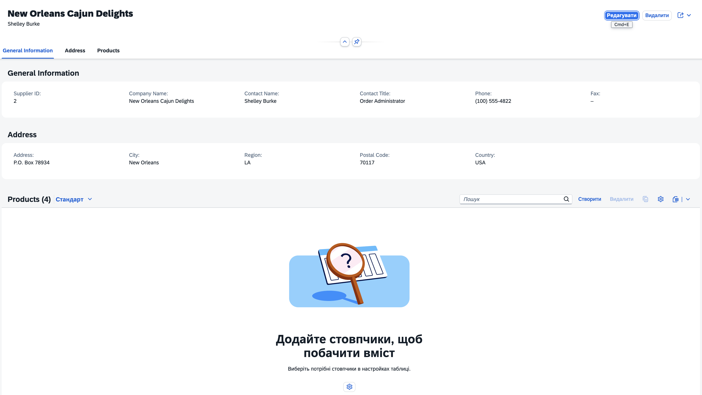
</p>

---

## 2.11. Налаштування таблиці Products

Тепер необхідно описати представлення сутності `Product`.

У файлі:

```text
webapp/annotations/annotation.xml
```

**після завершення секції**

```xml
<Annotations Target="NorthwindModel.Supplier">
    ...
</Annotations>
```

створіть **нову окрему секцію** для сутності `Product`:

```xml
<Annotations Target="NorthwindModel.Product">
```

> **Важливо:** секція `NorthwindModel.Product` створюється на тому самому рівні, що й `NorthwindModel.Supplier`, усередині `<Schema>`. Її не потрібно вкладати в секцію `NorthwindModel.Supplier`.

У створеній секції визначте анотацію `UI.LineItem`:

```xml
<Annotation Term="UI.LineItem">
    ...
</Annotation>
```

Таким чином, загальна структура файла повинна мати такий вигляд:

```xml
<Schema ...>

    <Annotations Target="NorthwindModel.Supplier">
        ...
    </Annotations>

    <Annotations Target="NorthwindModel.Product">

        <Annotation Term="UI.LineItem">
            ...
        </Annotation>

    </Annotations>

</Schema>
```

`UI.LineItem` для сутності `Product` визначає колонки, які відображатимуться в таблиці пов'язаних товарів у секції **Products** на сторінці постачальника.

Визначте `UI.LineItem`:

```xml
<Annotation Term="UI.LineItem">
    <Collection>
        <Record Type="UI.DataField">
            <PropertyValue Property="Label" String="Product ID" />
            <PropertyValue Property="Value" Path="ProductID" />
        </Record>
        <Record Type="UI.DataField">
            <PropertyValue Property="Label" String="Product Name" />
            <PropertyValue Property="Value" Path="ProductName" />
        </Record>
        <Record Type="UI.DataField">
            <PropertyValue Property="Label" String="Quantity Per Unit" />
            <PropertyValue Property="Value" Path="QuantityPerUnit" />
        </Record>
        <Record Type="UI.DataField">
            <PropertyValue Property="Label" String="Unit Price" />
            <PropertyValue Property="Value" Path="UnitPrice" />
        </Record>
        <Record Type="UI.DataField">
            <PropertyValue Property="Label" String="Units In Stock" />
            <PropertyValue Property="Value" Path="UnitsInStock" />
        </Record>
        <Record Type="UI.DataField">
            <PropertyValue Property="Label" String="Discontinued" />
            <PropertyValue Property="Value" Path="Discontinued" />
        </Record>
    </Collection>
</Annotation>
```

Після цього секція **Products** на сторінці постачальника повинна містити таблицю пов'язаних товарів.

<p align="center">
    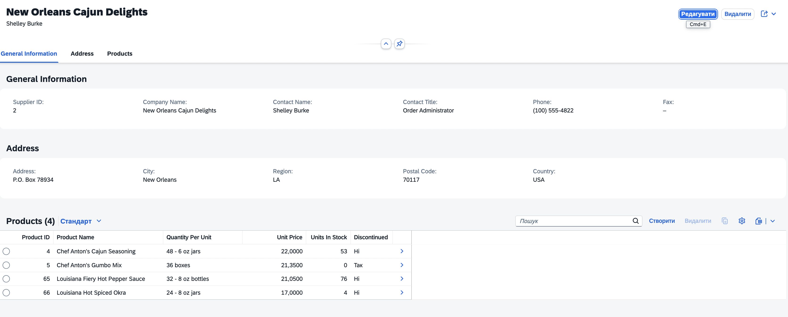
</p>

---

## 2.12. Налаштування Object Page товару

Для можливості переходу з таблиці **Products** на сторінку окремого товару додайте для `NorthwindModel.Product` необхідні анотації.

Усі наведені нижче анотації додавайте в уже створену секцію:

```xml
<Annotations Target="NorthwindModel.Product">
```

**після анотації `UI.LineItem`.**

Таким чином, структура секції матиме такий вигляд:

```xml
<Annotations Target="NorthwindModel.Product">
    <Annotation Term="UI.LineItem">
        ...
    </Annotation>
    <!-- Анотації Object Page товару додаються тут -->
</Annotations>
```

## 2.12.1. HeaderInfo

Додайте після `UI.LineItem`:

```xml
<Annotation Term="UI.HeaderInfo">
    <Record Type="UI.HeaderInfoType">
        <PropertyValue Property="TypeName" String="Product" />
        <PropertyValue Property="TypeNamePlural" String="Products" />
        <PropertyValue Property="Title">
            <Record Type="UI.DataField">
                <PropertyValue Property="Value" Path="ProductName" />
            </Record>
        </PropertyValue>
        <PropertyValue Property="Description">
            <Record Type="UI.DataField">
                <PropertyValue Property="Value" Path="QuantityPerUnit" />
            </Record>
        </PropertyValue>
    </Record>
</Annotation>
```

## 2.12.2. General Information

Додайте після `UI.HeaderInfo`:

```xml
<Annotation Term="UI.FieldGroup" Qualifier="GeneralInformation">
    <Record Type="UI.FieldGroupType">
        <PropertyValue Property="Data">
            <Collection>
                <Record Type="UI.DataField">
                    <PropertyValue Property="Label" String="Product ID" />
                    <PropertyValue Property="Value" Path="ProductID" />
                </Record>
                <Record Type="UI.DataField">
                    <PropertyValue Property="Label" String="Product Name" />
                    <PropertyValue Property="Value" Path="ProductName" />
                </Record>
                <Record Type="UI.DataField">
                    <PropertyValue Property="Label" String="Quantity Per Unit" />
                    <PropertyValue Property="Value" Path="QuantityPerUnit" />
                </Record>
                <Record Type="UI.DataField">
                    <PropertyValue Property="Label" String="Unit Price" />
                    <PropertyValue Property="Value" Path="UnitPrice" />
                </Record>
                <Record Type="UI.DataField">
                    <PropertyValue Property="Label" String="Units In Stock" />
                    <PropertyValue Property="Value" Path="UnitsInStock" />
                </Record>
                <Record Type="UI.DataField">
                    <PropertyValue Property="Label" String="Units On Order" />
                    <PropertyValue Property="Value" Path="UnitsOnOrder" />
                </Record>
                <Record Type="UI.DataField">
                    <PropertyValue Property="Label" String="Reorder Level" />
                    <PropertyValue Property="Value" Path="ReorderLevel" />
                </Record>
                <Record Type="UI.DataField">
                    <PropertyValue Property="Label" String="Discontinued" />
                    <PropertyValue Property="Value" Path="Discontinued" />
                </Record>
            </Collection>
        </PropertyValue>
    </Record>
</Annotation>
```

## 2.12.3. Facets

Нижче додайте:

```xml
<Annotation Term="UI.Facets">
    <Collection>
        <Record Type="UI.ReferenceFacet">
            <PropertyValue
                Property="Label"
                String="General Information" />
            <PropertyValue
                Property="Target"
                AnnotationPath="@UI.FieldGroup#GeneralInformation" />
        </Record>
    </Collection>
</Annotation>
```

Після збереження змін перевірте перехід:

```text
Suppliers
    ↓
Supplier Object Page
    ↓
Products
    ↓
Product Object Page
```
<p align="center">
    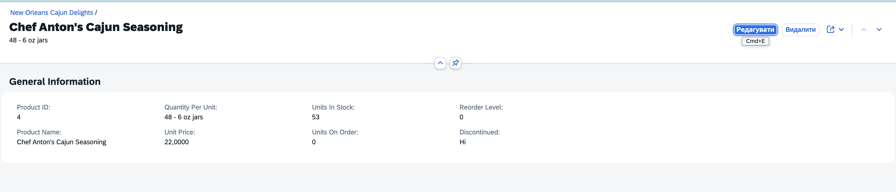
</p>

---

# 2.13. Готовий файл annotation.xml

Після виконання всіх попередніх кроків порівняйте отриманий файл із готовим варіантом:

➡️ [Готовий annotation.xml](./resources/annotation.xml)

Не рекомендується копіювати готовий файл до виконання попередніх кроків. Мета роботи — послідовно простежити, як окремі OData-анотації впливають на інтерфейс SAP Fiori Elements застосунку.

---

# 2.14. Перевірка результату

Після завершення налаштування анотацій виконайте Preview ще раз.

Перевірте:
1. List Report містить список постачальників.
2. У таблиці відображаються задані колонки.
3. Filter Bar дозволяє використовувати задані поля.
4. Вибір постачальника відкриває його Object Page.
5. Object Page містить секції **General Information**, **Address** та **Products**.
6. У секції Products відображаються товари відповідного постачальника.
7. Вибір товару відкриває Product Object Page.
8. Product Object Page відображає детальну інформацію про товар.
Очікувана навігація:
```text
Suppliers List Report
        │
        ▼
Supplier Object Page
        │
        ├── General Information
        ├── Address
        │
        └── Products
                │
                ▼
        Product Object Page
```

---

## 2.15. Build, Deploy та додавання Suppliers до SAP Build Work Zone

Після завершення розробки та успішного локального тестування виконайте **build, deploy та додавання застосунку Suppliers до SAP Build Work Zone** за аналогією із застосунком **Hello World**, створеним у першій частині практичної роботи.

> **Важливо:** у SAP BTP Trial можливість одночасного розгортання декількох застосунків обмежена. Тому для розгортання застосунку **Suppliers** виконайте deployment безпосередньо з термінала SAP Business Application Studio.

Відкрийте термінал та перейдіть до каталогу проєкту:

```bash
cd ~/projects/suppliersapp
```

Виконайте команду:

```bash
npm run deploy
```

Дочекайтеся успішного завершення deployment.

Після розгортання додайте застосунок **Suppliers** до **SAP Build Work Zone**, виконавши ті самі дії, що й для застосунку **Hello World** у першій частині практичної роботи.

Запустіть **Suppliers** із SAP Build Work Zone та перевірте коректність завантаження даних і навігації:

```text
Suppliers → Supplier → Products → Product
```

У результаті застосунок **Suppliers** повинен бути розгорнутий у SAP BTP, доступний із SAP Build Work Zone та отримувати дані з **Northwind OData Service**.

<p align="center">
    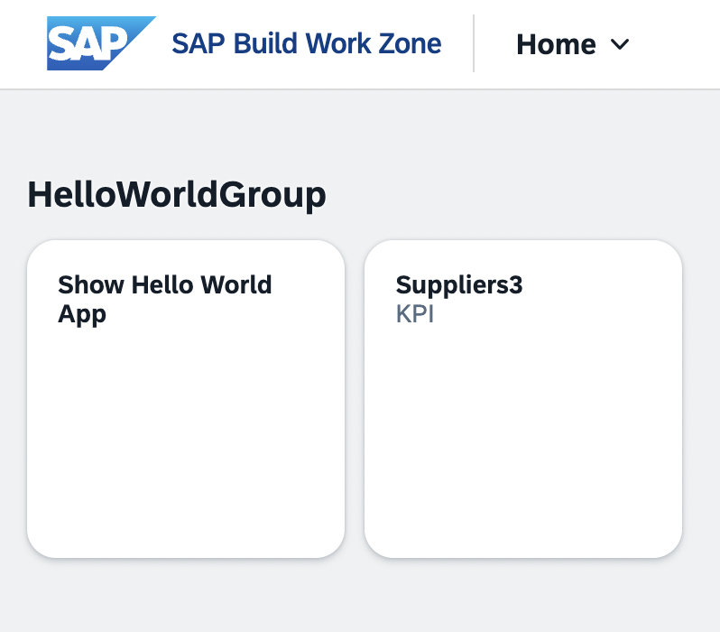
</p>

---

# 2.16. Результат виконання другої частини практичної роботи

У результаті виконання практичної роботи має бути створено та розгорнуто SAP Fiori Elements застосунок **Suppliers App**, який:
- отримує дані із зовнішнього Northwind OData Service;
- використовує SAP BTP Destination;
- відображає список постачальників;
- підтримує фільтрацію даних;
- містить Object Page постачальника;
- відображає пов'язані товари;
- підтримує перехід на Object Page товару;
- використовує локальні OData-анотації для формування інтерфейсу;
- розгорнутий у SAP BTP Cloud Foundry;
- доступний із SAP Build Work Zone.

---

## Структура матеріалів практичної роботи

```text
practical-01/
│
├── README.md
│
├── resources/
│   ├── destination.json
│   └── annotation.xml
│
└── images/
```

У каталозі `resources` розміщуються готові конфігураційні файли, які можна використовувати для перевірки результату виконання роботи.
